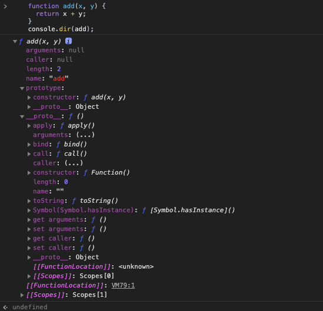

# 함수 객체 : 함수도 객체다

## 자바스크립트에서는 함수도 객체다.

- 함수 자체가 일반 객체처럼 프로퍼티들을 가질 수 있다.

```javascript
// 함수 선언 방식으로 add()함수 정의
function add(x, y) {
  return x + y;
}
// add()함수 객체에 result, status 프로퍼티 추가
add.result = add(2, 3);
add.status = "OK";
```

위의 코드는 함수 선언문 방식으로 add()함수를 생성한 후, add()함수가 일반 객체처럼 result와 status라는 프로퍼티를 추가하는 게 가능하다는 것을 보여준다.

1. add()함수를 생성할 때 함수 코드는 함수 객체의 [[Code]]내부 프로퍼티에 자동으로 저장된다.
2. add()함수에 마치 일반 객체처럼 result 프로퍼티를 동적으로 생성하고, 여기에 add()함수를 호출한 결과를 저장한 것을 확인할 수 있다.
3. add()함수 객체의 status 프로퍼티도 일반 객체에서의 접근 방식처럼 add.status를 이용해 접근 가능하다.
   이처럼 자바스크립트에서 함수는 특정 기능의 코드를 수행하는 역할뿐만 아니라, 일반 객체처럼 자신의 프로퍼티를 가질 수 있는 특별한 객체라고 볼 수 있다.

## 자바스크립트에서 함수는 값으로 취급된다.

- 자바스크립트에서는 함수는 객체다. **함수도 일반 객체처럼 취급될 수 있다**

- 아래와 같은 특징 때문에 자바스크립트에서는 함수를 **일급 객체**라 부른다.

1. 리터럴에 의해 생성
2. 변수나 배열의 요소, 객체의 프로퍼티 등에 할당 가능
3. 함수의 인자로 전달 가능
4. 함수의 리턴값으로 리턴 가능
5. 동적으로 프로퍼티를 생성 및 할당 가능

2-2. 변수나 프로퍼티의 값으로 할당

```javascript
// 변수에 함수 할당
var foo = 100;
var bar = function() {
  return 100;
};
console.log(bar()); // 100

// 프로퍼티에 함수 할당
var obj = {};
obj.baz = function() {
  return 200;
};
console.log(obj.baz()); // 200
```

2-3. 함수 인자로 전달

```javascript
// 함수 표현식으로 foo() 함수 생성
var foo = function(func) {
  func(); // 인자로 받은 func()함수 호출
};

// foo() 함수 실행
foo(function() {
  console.log("Function can be used as the argument.");
}); // Function can be used as the argument.
```

foo() 함수를 호출할 때, 함수 리터럴 방식으로 생성한 익명 함수를 func 인자로 넘겼다. 따라서 foo() 함수 내부에서는 func 매개변수로 인자에 넘겨진 함수를 호출할 수 있다.
예제의 출력결과를 보면 알 수 있듯이 인자로 넘긴 익명 함수가 foo()함수 내부에서 제대로 호출된 것을 볼 수 있다.

2-4. 리턴값으로 활용

```javascript
// 함수를 리턴하는 foo()함수 정의
var foo = function() {
  return function() {
    console.log("this function is the return value");
  };
};
var bar = foo();
bar(); // this function is the return value
```

    1.  foo() 함수가 호출되면, 리턴값으로 전달되는 함수가 bar 변수에 저장된다.
    2.  ()함수 호출 연산자를 이용해 bar()로 리턴된 함수를 실행하는 것이 가능하다.

## 함수 객체의 기본 프로퍼티

```javascript
// add()함수 객체 프로퍼티를 출력하는 코드
function add(x, y) {
  return x + y;
}
console.dir(add);
```

결과를 살펴보면 add함수는 arguments, caller, length 등과 같은 다양한 프로퍼티가 기본적으로 생성되어 있다.



ECMA 스크립트 명세서에는 모든 함수가 length와 prototype 프로퍼티를 가져야 한다고 기술하고 있다.

- name : 함수의 이름
- caller : 자신을 호출한 함수(현재 add()함수를 호출하지 않았으므로 null)
- arguments : 함수를 호출할 때 전달된 인자값(add()함수가 호출된 상태가 아니므로 null)
- \_\_proto\_\_ : 크롬 브라우저에는 [[prototype]]이라는 내부 프로퍼티가 \_\_proto\_\_프로퍼티로 구현이 되어있다.
  add() 함수 역시 자바스크립트 객체이므로 \_\_proto\_\_프로퍼티를 가지고 있고 이를 통해 자신의 부모 역할을 하는 프로토타입 객체를 가리킨다.
  add()와 같이 함수 객체의 부모 역할을 하는 프로토타입 객체를 **Function.prototype 객체**라고 명명하고 있으며, 이것 역시 **함수 객체**라고 정의하고 있다.

- length : 함수 작성 시 정의한 인자 개수

```javascript
function func0() {}
function func1(x) {
  return x;
}
function func2(x, y) {
  return x + y;
}
function func3(x, y) {
  return x + y + z;
}
console.log("func0.length : " + func0.length); // func0.length : 0
console.log("func1.length : " + func1.length); // func1.length : 1
console.log("func2.length : " + func2.length); // func2.length : 2
console.log("func3.length : " + func3.length); // func3.length : 3
```

- prototype :
  모든 객체의 부모를 나타내는 내부프로퍼티인 [[Prototype]]과 다르다
  (prototype프로퍼티와 [[Prototype]]프로퍼티는 두 프로퍼티 모두 프로토타입 객체를 가리킨다는 점에서 공통점이 있지만, 관점에 차이가 있다
  모든 객체에 있는 내부 프로퍼티인 [[Prototype]]는 객체 입장에서 자신의 부모역할을 하는 프로토타입 객체를 가리키는 반면에, 함수 객체가 가지는 prototype 프로퍼티는
  이 함수가 생성자로 사용될 때 이 함수를 통해 생성된 객체의 부모 역할을 하는 프로토타입 객체를 가리킨다.)

  prototype프로퍼티는 함수가 생성될 때 만들어지며, **constructor 프로퍼티 하나만 있는 객체**를 가리킨다.
  prototype프로퍼티가 가리키는 프로토타입 객체의 유일한 constructor 프로퍼티는 자신과 연결된 함수를 가리킨다.
  즉, 자바스크립트에서는 함수를 생성할 때, 함수 자신과 연결된 프로토타입 객체를 동시에 생성하며, 각각 prototype과 constructor라는 프로퍼티로 서로 참조하게 된다.

```javascript
// MyFunction()함수 정의
function myFunction() {
  return true;
}
console.dir(myFunction.prototype);
console.dir(myFunction.prototype.constructor);
```

1. myFunction()이라는 함수가 생성됨과 동시에 myFunction()함수의 prototype 프로퍼티에는 이 함수와 연결된 프로토타입 객체가 생성된다.
2. myFunction.prototype은 myFunction()함수의 프로토타입 객체를 의미한다.
   myFunction.prototype 객체는 constructor와 \_\_proto\_\_라는 두 개의 프로퍼티가 있다. 이 객체는 myFunction() 함수의 프로토타입 객체이므로 constructor 프로퍼티가 있음
   또한 프로토타입 객체 역시 자바스크립트 객체이므로 예외 없이 자신의 부모역할을 하는 \_\_proto\_\_프로퍼티가 있다.
3. myFunction.prototype.constructor의 값을 출력함으로 프로토타입 객체와 매핑된 함수를 알아볼 수 있다. 결과값을 보면 myFunction()함수를 가리키고 있다.
4. 함수 객체와 프로토타입 객체는 서로 밀접하게 연결돼 있다.
