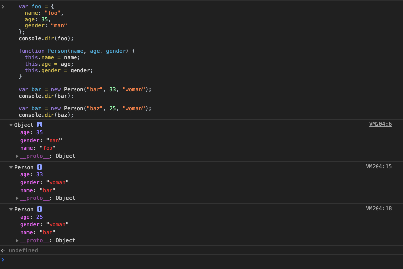

# 함수 호출과 this

## arguments객체

- 함수를 호출할 때 함수 형식에 맞춰 인자를 넘기지 않아도 에러가 발생하지 않는다.

```javascript
function func(arg1, arg2) {
  console.log(arg1, arg2);
}
func(); // undefined undefined
func(1); // 1, undefined
func(1, 2); // 1, 2
func(1, 2, 3); // 1, 2
```

- 정의된 함수의 인자보다 적게 함수를 호출했을 경우, 넘겨지지 않은 인자에서는 undefined 값이 할당되고,
  인자값을 초과하여 입력했을 경우 초과된 인수는 무시된다.

- arguments객체는 **함수를 호출할 때 넘긴 인자들이 배열 형태로 저장된 객체를 의미**
  이 객체는 실제 배열이 아닌 유사배열 객체이다.

```javascript
// arguments 객체 예제 코드
function add(a, b) {
  console.dir(arguments);
  return a + b;
}
console.log(add(1));
console.log(add(1, 2));
console.log(add(1, 2, 3));
```

- arguments객체는 다음과 같이 세 부분으로 구성되어 있다.

1. 함수를 호출할 때 넘겨진 인자(배열형태) : 함수를 호출할 때 첫번째 인자는 0번 인덱스, 두번째 인자는 1번 인덱스,,
2. length 프로퍼티 : 호출할 때 넘겨진 인자의 개수를 의미
3. callee 프로퍼티 : 현재 실행 중인 함수의 참조값(위에서는 add()함수)

- arguments는 객체이지 배열이 아니다. 그러나 유사 배열 객체에서 배열 메서드를 사용하는 방법이 있다(call, apply메서드를 이용한 명시적인 this 바인딩)

## 호출 패턴과 this 바인딩

- 자바스크립트에서 함수를 호출할 때 기존 매개변수로 전달되는 인자값에 더해, arguments객체 및 this인자가 함수 내부로 암묵적으로 전달 된다.
  자바스크립트의 여러가지 함수가 호출되는 방식(호출패턴)에 따라 this는 다른 객체를 참조(this 바인딩)한다.

  1. 객체의 메서드 호출할 때 this 바인딩

  - 메서드 내부 코드에서 사용된 this는 해당 메서드를 **호출한 객체로 바인딩** 한다.

  ```javascript
  var myObject = {
    name: "foo",
    sayName: function() {
      console.log(this.name);
    }
  };
  var otherObject = {
    name: "bar"
  };
  otherObject.sayName = myObject.sayName;

  myObject.sayName(); //foo
  otherObject.sayName(); //bar
  ```

  - sayName()메서드에서 사용된 this는 자신을 호출한 객체에 바인딩 된다.

  2. 함수를 호출할 때 this 바인딩

  - 함수를 호출하면, 해당 함수 내부 코드에서 사용된 this는 **전역객체에 바인딩** 된다.(브라우저에서 실행할 경우 window객체)

  ```javascript
  var foo = "I'm foo";
  console.log(foo); //I'm foo
  console.log(window.foo); // I'm foo
  ```

  ```javascript
  // 함수를 호출할 때 this 바인딩
  var test = "This is test";
  console.log(window.test); // 'This is test'
  var sayFoo = function() {
    console.log(this.test);
  };
  sayFoo(); // 'This is test'
  ```

  - **this 바인딩 특성은 내부 함수를 호출했을 경우에도 그대로 적용**

  ```javascript
  // 내부 함수의 this 바인딩 동작을 보여주는 예제 코드
  var value = 100;

  var myObject = {
    value: 1,
    func1: function() {
      this.value += 1;
      console.log("func1() called. this.value : " + this.value);

      func2 = function() {
        this.value += 1;
        console.log("func2() called. this.value : " + this.value);

        func3 = function() {
          this.value += 1;
          console.log("func3() called. this.value : " + this.value);
        };
        func3();
      };
      func2();
    }
  };
  myObject.func1();
  ```

  1. func1()은 myObject의 메서드, myObject.func1()과 같이 메서드로 호출할 때는 메서드 코드 내에서 사용된 this는 자신을 호출한 객체를 가리키므로, func1()에서 사용된 this는 이 메서드를 호출한 객체 myObject를 가리킨다.
  2. func2()는 func1()을 부모함수로 하여, func2() 내부 함수의 this는 당연히 부모함수의 this와 같은 객체인 myObject를 가리킨다고 생각하는게 자연스럽다.
  3. func3() 함수의 this도 마찬가지로, 자신의 부모함수인 func2()의 this와 같이 myObject 객체를 가리킨다고 생각할 수 있다.

  - 예상결과 :
    func1() called. this. value : 2
    func2() called. this. value : 3
    func3() called. this. value : 4

  - 출력결과 :
    func1() called. this. value : 2
    func2() called. this. value : 101
    func3() called. this. value : 102

  - 예상과 출력 결과가 다른 이유는 자바스크립트에서는 내부 함수 호출 패턴을 정의해 놓지 않기 때문
    내부 함수도 결국 함수이므로 이를 호출할 때는 함수 호출로 취급된다.
    때문에 **함수 호출 패턴 규칙에 따라 내부 함수의 this는 전역객체에 바인딩 된다.**

  - 이를 극복하기 위해선 부모 함수의 this를 내부함수가 접근 가능한 다른 변수에 저장 (관례상 that)

  ```javascript
  // 내부 함수의 this 바인딩 문제 해결
  var value = 100;
  var myObject = {
    value: 1,
    func1: function() {
      var that = this;
      this.value += 1;
      console.log("func1() called. this. value : " + this.value);

      func2 = function() {
        that.value += 1;
        console.log("func2() called. this. value : " + that.value);

        func3 = function() {
          that.value += 1;
          console.log("func3() called. this. value : " + that.value);
        };
        func3();
      };
      func2();
    }
  };
  myObject.func1();
  ```

  - 출력결과
    func1() called. this. value : 2
    func2() called. this. value : 3
    func3() called. this. value : 4

  1. 부모 함수인 func1()의 this값을 that 변수에 저장했다. 앞서 내부 함수의 특징에서 설명했듯이 func2()와 func3() 내부 함수는 자신을 둘러싼 부모 함수인 func1() 변수에 접근 가능하므로, func2()와 func3()도 that 변수로 func1()의 this가 바인딩된 객체인 myObject에 접근 가능하게 된다.
  2. func1() 함수의 this는 myObject를 가리키므로, myObject.value 값이 1증가 한다.
  3. 부모 함수 func1()의 that 변수에도 myObject 객체의 참조값이 저장되어 있으므로, myObject.value값이 각각 1씩 증가한다.

3.  생성자 함수를 호출할 떄 this 바인딩

    - 생성자 함수가 동작하는 방식(new 연산자)

    1. 빈 객체 생성 및 this 바인딩
       생성자 함수 코드가 실행되기 전 **빈 객체가 생성**(빈 객체라도 프로토타입이 있다)된다. 이 객체가 생성자 함수가 새로 생성하는 객체이며, 이 객체는 this로 바인딩 된다. 따라서 이후 생성자 함수의 코드 내부에서 사용된 this는 이 빈 객체를 가리킨다.
       이렇게 생성자 함수가 생성한 객체는 **자신을 생성한 생성자 함수의 prototype 프로퍼티가 가리키는 객체를 자신의 프로토타입 객체로 설정**한다.
    2. this를 통한 프로퍼티 생성
       이후에는 함수 코드 내부에서 this를 사용해서, 앞에서 생성된 빈 객체에 동적으로 프로퍼티나 메서드를 생성할 수 있다.
    3. 생성된 객체 리턴
       리턴문이 동작하는 방식은 경우에 따라 다름
       특별하게 리턴문이 없을 경우, this로 바인딩된 새로 생성한 객체가 리턴, 이것은 명시적으로 this를 리턴해도 결과는 같다.
       하지만 리턴값이 새로 생성한 객체(this)가 아닌 다른 객체를 반환하는 경우는 생성자 함수를 호출했다고 하더라도 this가 아닌 해당 객체가 리턴 된다.

    ```javascript
    // 생성자 함수의 동작 방식
    var Person = function(name) {
      this.name = name;
    };

    var foo = new Person("foo");
    console.log(foo.name); // foo
    ```

    - new로 호출 하면, Person()은 생성자 함수로 동작한다.

    1. Person()함수가 생성자로 호출되면, 함수 코드가 실행되기 전에 빈 객체가 생성된다. 여기서 생성된 빈 객체는 Person()생성자 함수의 prototype 프로퍼티가 가리키는 객체(Person.prototype 객체)를 \[\[Prototype\]\]링크로 연결해서 자신의 프로토타입으로 설정한다. 그리고 이렇게 생성된 객체는 생성자 함수 코드에서 사용되는 this로 바인딩 된다.
    2. this가 가리키는 빈 객체에 name이라는 동적 프로퍼티를 생성했다.
    3. 리턴값이 특별히 없으므로 this로 바인딩한 객체가 생성자 함수의 리턴값으로 반환돼서, foo 변수에 저장된다.

    - 객체 리터럴 방식과 생성자 함수를 통한 객체 생성 방식의 차이

    ```javascript
    // 객체 생성 두가지 방법
    var foo = {
      name: "foo",
      age: 35,
      gender: "man"
    };
    console.dir(foo);

    function Person(name, age, gender) {
      this.name = name;
      this.age = age;
      this.gender = gender;
    }

    var bar = new Person("bar", 33, "woman");
    console.dir(bar);

    var baz = new Person("baz", 25, "woman");
    console.dir(baz);
    ```

    

    - 두 방법의 차이는 프로토타입객체(proto 프로퍼티)에 있다.
      리터럴 방식 : 자신의 프로토타입 객체가 Object
      생성자 함수 : 자신의 프로토타입 객체가 Person

      - 자바스크립트 객체는 자신을 생성한 **생성자 함수의 prototype 프로퍼티**가 가리키는 객체를 **자신의 프로토타입 객체**로 설정한다.
      - **객체 리터럴 방식**에서는 객체 생성자 함수는 **Object()**이며, **생성자 함수 방식**의 경우는 **생성자 함수 자체**

    - 생성자 함수를 new를 붙이지 않고 호출할 경우 this는 함수 호출이므로 전역 객체인 window 객체로 바인딩 된다.

4.  call과 apply 메서드를 이용한 명시적인 바인딩

- 자바스크립트는 내부적인 this 바인딩 이외에도 **this를 특정객체에 명시적으로 바인딩**할 수 있다.
- apply(), call()은 모든 함수의 부모 객체인 Function.prototype 객체의 메서드이다.
- apply() 메서드를 호출하는 주체는 함수이고, apply()메서드도 this를 특정객체에 바인딩할 뿐 **본질적인 기능은 함수 호출**이다.
  Person.apply()이렇게 호출한다면 이것의 기본 기능은 Person()함수를 호출하는 것이다.

- function.apply(thisArg, argArray)
  **첫 번째 인자 thisArg**는 apply()메서드를 호출한 **함수 내부에서 사용한 this에 바인딩할 객체**를 가리킨다. 즉, 첫 번째 인자로 넘긴 객체가 this로 명시적으로 바인딩되는 것이다.
  두 번째 argArray 인자는 함수를 호출할 때 넘길 인자들의 배열을 가리킨다. apply() 메서드의 기능도 결국 함수를 호출하는 것이므로, 함수에 넘길 인자를 argArray 배열로 넘긴다.
  apply()메서드를 정리하면, **두 번째 인자인 argArray 배열을 자신을 호출한 함수의 인자로 사용하되, 이 함수 내부에서 사용된 this는 첫 번째 인자인 thisArg 객체로 바인딩해서 함수를 호출하는 기능을 하는것이다.**

  ```javascript
  // apply()메서드를 이용한 명시적인 this 바인딩
  function Person(name, age, gender) {
    this.name = name;
    this.age = age;
    this.gender = gender;
  }
  var foo = {};
  Person.apply(foo, ["foo", 30, "man"]);
  console.dir(foo);
  ```

  1. foo는 리터럴 방식으로 생성한 빈 객체
  2. apply()메서드를 사용해서, Person() 함수를 호출한 코드다. 첫 번째 인자로 넘긴 foo가 Person() 함수에서 this로 바인딩 된다. 그리고 apply() 메서드의 두 번째 인자로 넘긴 배열 ['foo', 30, 'man']은 호출하려는 Person()의 인자 name, age, gender로 각각 전달된다.
  3. 이 코드는 결국 **Person('foo', 30, 'man')함수를 호출하면서 this를 foo객체에 명시적으로 바인딩하는 것**을 의미한다.

- call()메서드는 apply()메서드의 argArray에서 배열이 아닌 인자 하나하나를 넣으면 된다. Person.call(foo, 'foo', 30, 'man')

- apply(), call()의 대표적 용도가 arguments 객체에서 설명한 arguments 객체와 같은 유사 배열 객체에서 배열 메서드를 사용하는 경우이다.

```javascript
//apply()메서드를 활용한 arguments 객체의 배열 표준 메서드 slice() 활용 코드
function myFunction() {
  console.dir(arguments);
  // arguments 객체를 배열로 변환
  var args = Array.prototype.slice.apply(arguments);
  console.dir(args);
}
myFunction(1, 2, 3);
```

1. arguments에서 배열메서드를 사용하려면 error 발생
2. 이 경우 apply() 메서드로 arguments객체에서 마치 배열 메서드가 있는 것처럼 처리
   var args = Array.prototype.slice.apply(arguments); => **Array.prototype.slice()메서드를 호출하라. 이때 this는 arguments 객체로 바인딩 하라**

## 함수리턴

- 자바스크립트 함수는 항상 리턴값을 반환한다.
- return문을 사용하지 않았더라도 다음의 규칙으로 리턴값을 전달한다.

1. 일반 함수나 메서드는 리턴값을 지정하지 않을 경우, undefined 값이 리턴된다.

```javascript
var noReturnFunc = function() {
  console.log("This function has no return statement");
};
var result = noReturnFunc();
console.log(result);
```

// This function has no return statement
// undefined
return문이 없는 함수의 경우, 함수를 호출할 때 undefined 값이 리턴된다.

2. 생성자 함수에서 리턴값을 지정하지 않을 경우 생성된 객체가 리턴된다.

- 생성자 함수에서는 일반적으로 리턴값을 지정하지 않는다.
- 생성자 함수에서 리턴값을 처리하는 몇 가지 예외 상황

```javascript
// 생성자 함수에서 명시적으로 객체를 리턴했을 경우
function Person(name, age, gender) {
  this.name = name;
  this.age = age;
  this.gender = gender;

  return { name: "bar", age: 20, gender: "woman" };
}
var foo = new Person("foo", 30, "man");
console.dir(foo);
```

- 위의 경우 생성자 함수의 리턴값을 새로 생성한 객체가 아니라, 객체 리터럴 방식의 특정 객체로 지정한 경우 new 연산자로 Person() 생성자 함수를 호출해서 새로운 객체를 생성하더라도, **리턴값에서 명시적으로 넘긴 객체나 배열이 리턴된다.**

```javascript
// 생성자 함수에서 명시적으로 기본타입값을 리턴했을 경우
function Person(name, age, gender) {
  this.name = name;
  this.age = age;
  this.gender = gender;

  return 100;
}
var foo = new Person("foo", 30, "man");
console.log(foo); // Person {name: 'foo', age:30, gender:'man'}
```

- 위의 경우 출력결과는 100이 아니라 foo객체값이 리턴된다.
