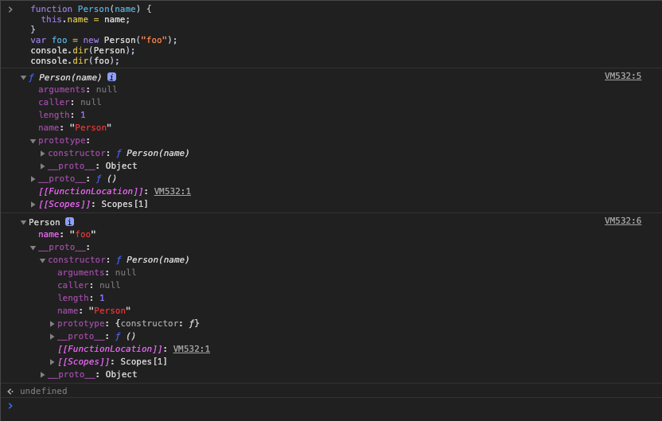

# 프로토타입 체이닝

## 프로토타입의 두 가지 의미

- 자바스크립트는 프로토타입 기반의 객체지향 프로그래밍을 한다.
- 자바스크립트의 모든 객체는 자신의 부모인 프로토타입 객체를 가리키는 참조 링크 형태의 숨겨진 프로퍼티가 있다.
  이러한 링크를 암묵적 프로토타입 링크라고 부르며, 이러한 링크는 모든 객체의 \[\[Prototype\]\]프로퍼티에 저장된다.

- prototype프로퍼티와 프로토타입 링크 구분
  자바스크립트에서 모든 객체는 자신을 생성한 생성자 함수의 prototype프로퍼티가 가리키는 프로토타입 객체를 자신의 부모 객체로 설정하는 프로토타입링크로 연결 한다.

  ```javascript
  function Person(name) {
    this.name = name;
  }
  var foo = new Person("foo");
  console.dir(Person);
  console.dir(foo);
  ```

1. Person() 생성자 함수는 prototype 프로퍼티로 자신과 링크된 프로토타입 객체를 가리킨다.
   자바스크립트 객체 생성 규칙에 의해 Person() 생성자 함수로 생성된 foo 객체는 Person()함수의 프로토타입 객체를 \[\[Prototype\]\]링크로 연결한다.
   결국 prototype 프로퍼티나 \[\[Prototype\]\]링크는 같은 프로토타입 객체를 가리키고 있다.
   prototype 프로퍼티는 함수의 입장에서 자신과 링크된 프로토타입 객체를 가리키고 있으며, 이에 반해 \[\[Prototype\]\] 링크는 객체의 입장에서 자신의 부모 객체인 프로토타입 내부의 숨겨진 링크로 가리키고 있다.
   결국, **자바스크립트에서 객체를 생성하는 건 생성자 함수의 역할이지만, 생성된 객체의 실제 부모 역할을 하는 건 생성자 자신이 아닌 생성자의 prototype 프로퍼티가 가리키는 프로토타입 객체다.**



2. Person() 생성자 함수의 prototype 프로퍼티와 foo 객체의 \_\_proto\_\_프로퍼티(이것은 \[\[Prototype\]\] 프로퍼티를 의미한다)가 같은 프로토타입 객체를 가리키고 있다는 것을 알 수 있다.
   \_\_proto\_\_프로퍼티는 모든 객체에 존재하는 숨겨진 프로퍼티로 객체 자신의 프로토타입 객체를 가리키는 참조 링크 정보다.

3. \_\_proto\_\_프로퍼티나 \[\[Prototype\]\]프로퍼티는 같다고 간주하면 된다.

## 객체 리터럴 방식으로 생성된 객체의 프로토타입 체이닝

- 자바스크립트에서 객체는 자기 자신의 프로퍼티뿐만이 아니라, 자신의 부모 역할을 하는 프로토타입 객체의 프로퍼티 또한 마치 자신의 것처럼 접근하는게 가능하다.
  이것을 가능하게 하는 것이 바로 **프로토타입 체이닝**이다.

  ```javascript
  // 객체 리터럴 방식에서의 프로토타입 체이닝
  var myObject = {
      name: 'foo'
      sayName: function(){
          console.log('My Name is ' + this.name)
      }
  }
  myObject.sayName()// My Name is foo
  console.log(myObject.hasOwnProperty('name'))// true
  console.log(myObject.hasOwnProperty('nickname'))// false
  myObject.sayNickName()// error
  ```

  1. myObject의 객체에 hasOwnProperty()메서드가 없음에도 정상적으로 출력 된다.

  2. 객체 리터럴로 생성한 객체는 Object()라는 내장 생성자 함수로 생성된 것이다.
     Object() 생성자 함수도 함수 객체이므로 prototype이라는 프로퍼티 속성이 있다.
     따라서 앞서 설명한 자바스크립트의 규칙으로 생성한 객체 리터럴 형태의 myObject는 Object()함수의 prototype 프로퍼티가 가리키는 Object.prototype 객체를 자신의 프로토타입 객체로 연결한다.

- 프로토타입 체이닝
  자바스크립트에서 특정 객체의 프로퍼티나 메서드에 접근하려고 할 때, 해당 객체에 접근하려는 프로퍼티 또는 메서드가 없다면 \[\[Prototype\]\]링크를 따라 자신의 부모역할을 하는 프로토타입 객체의 프로퍼티를 차례대로 검색하는 것을 프로토타입 체이닝이라고 한다.

  3. 위의 코드에서도 myObject 객체에서 sayName()메서드를 호출할 때는 해당 객체 내에 메서드가 있어 바로 수행한다.

  4. hasOwnProperty()메서드 호출 시는 myObject 객체 내에 hasOwnProperty()메서드가 없기 때문에 myObject객체의 \[\[Prototype\]\]링크를 따라 그것의 부모역할을 하는 Object.prototype 프로토타입 객체내에 hasOwnProperty()메서드가 있는지를 검색한 후 있으면 수행한다.
     Object.prototype 객체는 자바스크립트 모든 객체의 조상역할을 하는 개체로 자바스크립트 모든 객체가 호출할 수 있는 표준 메서드를 제공한다.

## 생성자 함수로 생성된 객체의 프로토타입 체이닝

- **자바스크립트에서 모든 객체는 자신을 생성한 생성자 함수의 prototype 프로퍼티가 가리키는 객체를 자신의 프로토타입 객체(부모 객체)로 취급한다.**

```javascript
// 생성자 함수 방식에서의 프로토타입 체이닝
function Person(name, age, hobby) {
  (this.name = name), (this.age = age), (this.hobby = hobby);
}
var foo = new Person("foo", 30, "tennis");

// 프로토타입 체이닝
console.log(foo.hasOwnProperty("name")); // true
console.log(Person.prototype);
```

1. foo 객체의 생성자는 Person()함수이다. 따라서 자바스크립트의 룰에 따르면 foo 객체의 프로토타입 객체는 자신을 생성한 Person 생성자 함수 객체의 prototype 프로퍼티가 가리키는 객체(Person.prototype)가 된다.
   즉, **foo 객체의 프로토타입 객체는 Person.prototype**이 된다.
2. foo.hasOwnProperty() 메서드를 호출했지만, foo 객체는 hasOwnProperty()메서드가 없어서 프로토타입 체이닝으로 foo의 부모 객체인 Person.prototype 객체에서 hasOwnProperty()메서드를 찾는다.
   그러나 함수에 연결된 프로토타입 객체는 디폴트로 constructor 프로퍼티만을 가진 객체이므로 hasOwnProperty()메서드는 없다.
3. Person.prototype 역시 자바스크립트 객체이므로 Object.prototype을 프로토타입 객체로 가진다. 따라서 프로토타입 체이닝은 Object.prototype 객체로 이어진다.

## 프로토타입의 종점

- 자바스크립트에서 **Object.prototype 객체는 프로토타입 체이닝의 종점**이다.
- 모든 자바스크립트 객체는 프로토타입 체이닝으로 Object.prototype 객체가 가진 프로퍼티와 메서드에 접근하고, 서로 공유가 가능하다.

## 기본데이터 타입 확장

- Object.prototype에 정의된 메서드들은 자바스크립트의 모든 객체의 표준 메서드이다.
- 자바스크립트는 Object.prototype, String.prototype 등과 같이 표준 빌트인 프로토타입 객체에도 사용자가 직접 정의한 메서드를 추가하는 것을 허용한다.

```javascript
String.prototype.testMethod = function() {
  console.log("This is the String.prototype.testMethod()");
};
var str = "This is test";
str.testMethod();
console.dir(String.prototype);
```

1. String.prototype 또한 자신의 프로토타입이 있으며 그것이 Object.prototype이다.
   문자열 또한 프로토타입체이닝으로 hasOwnProperty()같은 Object.prototype메서드를 호출할 수 있다.

## 프로토타입도 자바스크립트 객체다

- 함수가 생성될 때, 자신의 prototype 프로퍼티에 연결되는 프로토타입 객체는 디폴트로 constructor 프로퍼티만을 가진 객체다.
  **프로토타입 객체 역시 자바스크립트 객체**이므로 일반 객체 처럼 동적으로 프로퍼티를 추가/삭제하는 것이 가능하다.

```javascript
// 프로토타입 객체의 동적 메서드 생성 예제 코드
function Person(name) {
  this.name = name;
}

var foo = new Person("foo");

//foo.sayHello();

Person.prototype.sayHello = function() {
  console.log("Hello");
};

foo.sayHello(); // Hello
```

## 프로토타입 메서드와 this 바인딩

- 메서드 호출 패턴에서의 this는 그 메서드를 호출한 객체에 바인딩된다.

```javascript
// 프로토타입 메서드와 this 바인딩
function Person(name) {
  this.name = name;
}
Person.prototype.getName = function() {
  return this.name;
};

var foo = new Person("foo");

console.log(foo.getName()); // foo

Person.prototype.name = "person";

console.log(Person.prototype.getName()); // person
```

1. foo 객체에서 getName()메서드를 호출하면, getName()메서드는 foo 객체에서 찾을 수 없으므로 프로토타입 체이닝이 발생한다. foo 객체의 프로토타입 객체인 Person.prototype에서 getName()메서드가 있으므로 메서드가 호출, 이때 getName()메서드를 호출한 객체는 foo이므로, this는 foo객체에 바인딩 된다.
2. 바로 Person.prototype 객체에 접근해서 getName()메서드를 호출하면 getName()메서드를 호출한 객체가 Person.prototype이므로 this도 여기에 바인딩 된다.

## 디폴트 프로토타입은 다른 객체로 변경이 가능하다.

- 디폴트 프로토타입 객체는 함수가 생성될 때 같이 생성되며, 함수의 prototype 프로퍼티에 연결 된다.
- 자바스크립트에서는 디폴트 프로토타입 객체를 다른 일반 객체로 변경하는 것이 가능하다.
  생성자 함수의 프로토타입 객체가 변경되면, 변경된 시점 이후에 생성된 객체들은 변경된 프로토타입 객체로의 \[\[Prototype\]\] 링크를 그대로 유지한다.

```javascript
function Person(name) {
  this.name = name;
}
console.log(Person.prototype.constructor); // f Person(name)

var foo = new Person("foo");
console.log(foo.country); // undefined
Person.prototype = {
  country: "korea"
};
console.log(Person.prototype.constructor); // Object()

var bar = new Person("bar");
console.log(foo.country); // undefined
console.log(bar.country); // korea
console.log(foo.constructor); // f Person(name)
console.log(bar.constructor); // Object()
```

1. Person()함수를 생성할 때 디폴트로 같이 생성되는 Person.prototype 객체는 자신과 연결된 Person() 생성자 함수를 가리키는 constructor 프로퍼티만을 가진다.
   때문에 Person.prototype.constructor는 Person()생성자 함수를 가리킨다.
2. 객체 생성 규칙에 따라 foo 객체는 Person.prototype 객체를 자신의 프로토타입으로 연결
   foo 객체는 country 프로퍼티가 없고 프로토타입 체이닝이 일어나도 country프로퍼티가 없으므로 undefined출력
3. Person.prototype을 country 키값을 가진 객체 리터럴 방식으로 생성
4. Person.protytype.consturctor는 constructor 프로퍼티가 없으므로 프로토타입체이닝이 발생 Object()생성자 함수를 constructor 프로퍼티에 연결하고 있으므로 Object() 생성자 함수가 출력
5. bar 객체 생성 시 Person()생성자 함수의 prototype 프로퍼티는 디폴트 프로토타입 객체가 아닌 새로 변경된 프로토타입 객체를 가리키고 있다.
   따라서 bar 객체는 새로 변경된 프로토타입 객체를 \[\[Prototype\]\]링크로 가리키게 된다.
6. foo 객체는 디폴트 프로토타입 객체를, bar 객체는 새로 변경된 프로토타입 객체를 각각 \[\[Prototype\]\]링크로 연결한다. 프로토타입이 달라서 foo 객체와 bar 객체는 프로토타입 체이닝이 서로 다른 결과값을 만든다.
   즉, foo.constructor는 Person()을 가리키고, bar.constructor는 Object()를 가리킨다.

## 객체의 프로퍼티 읽기나 메서드를 실행할 때만 프로토타입 체이닝이 동작한다.

- 객체에 있는 특정 프로퍼티에 값을 쓰려고 한다면 이때는 프로토타입 체이닝이 일어나지 않는다.

```javascript
//프로토타입 체이닝과 동적 프로퍼티 생성
function Person(name) {
  this.name = name;
}
Person.prototype.country = "Korea";

var foo = new Person("foo");
var bar = new Person("bar");
console.log(foo.country); // Korea
console.log(bar.country); // Korea
foo.country = "USA";

console.log(foo.country); // USA
console.log(bar.country); // KOREA
```

1. foo.country에 접근하려 했을 때 foo 객체는 name 프로퍼티밖에 없으므로 프로토타입 체이닝이 이뤄지면서 foo의 프로토타입 객체인 Person.prototype의 country 프로퍼티값인 'Korea'가 출력
2. foo.country 값에 'USA'라는 값을 저장하면, 프로토타입 체이닝이 동작하는 것이 아니라 foo 객체에 country 프로퍼티값이 동적으로 생성된다.
3. foo.country는 프로토타입 체이닝 없이 바로 'USA'값이 출력 되고 bar 객체는 프로토타입 체이닝을 거쳐 'Korea'가 출력
